# OFFBEAT

A deliberately user-unfriendly audio player for CS4501: Usability Engineering - HW1. The player uses local audio files and intentionally reverses the course guidelines documented below. Controls remain operable, and there are no random interruptions, forced waits, or moving buttons.

## Task instructions
Use the same MP3, at least 60 seconds long, in both players.

1. Load the MP3 from a local source.
2. Set the volume to **30%**.
3. Enable **looping** for that track.
4. Set the playback position to **00:45** and start playback from there.

## Testing results
Regular MP3 player for comparison: **Apple Music on macOS**.

| Participant | Regular MP3 player completion time (seconds) | OFFBEAT completion time (seconds) |
| --- | ---: | ---: |
| Subject 1 | 18 | 160 |
| Subject 2 | 11 | 130 |
| Subject 3 | 35 | 219 |
| Mean completion time (3 participants) | 21.33 | 169.67 |

### Baseline and interaction-cost comparison

**Baseline estimate:** 21.33 seconds, the mean of the three reported comparison-player times: (18 + 11 + 35) ÷ 3.  
**Justification:** The baseline uses the three participants’ reported completion times on the Apple Music on macOS.  
**Mean OFFBEAT completion time:** 169.67 seconds (approximately 2 minutes 50 seconds): (160 + 130 + 219) ÷ 3.  
**Observed overhead:** (509 ÷ 3) ÷ (64 ÷ 3) = **7.95×**, calculated from unrounded means. Subject 1: **8.89×**; Subject 2: **11.82×**; Subject 3: **6.26×**.

## Usability Engineering Guideline Violations
Each describes implemented behavior and its expected effect. Numbered boxes and captions annotate the supplied screenshots; the captured interface content is unchanged.

### 1. Guide users towards their goals - Thinking & Problem-Solving
Play is inside the closed “Other operations” menu below the footer. The unrelated label offers little information scent for someone looking for playback. Pause has a separate fixed location in the source panel. Applying a track position leaves audio paused; completing the task requires finding Play in this menu. The confirmation appears only after Play is selected, so it cannot bypass this search.

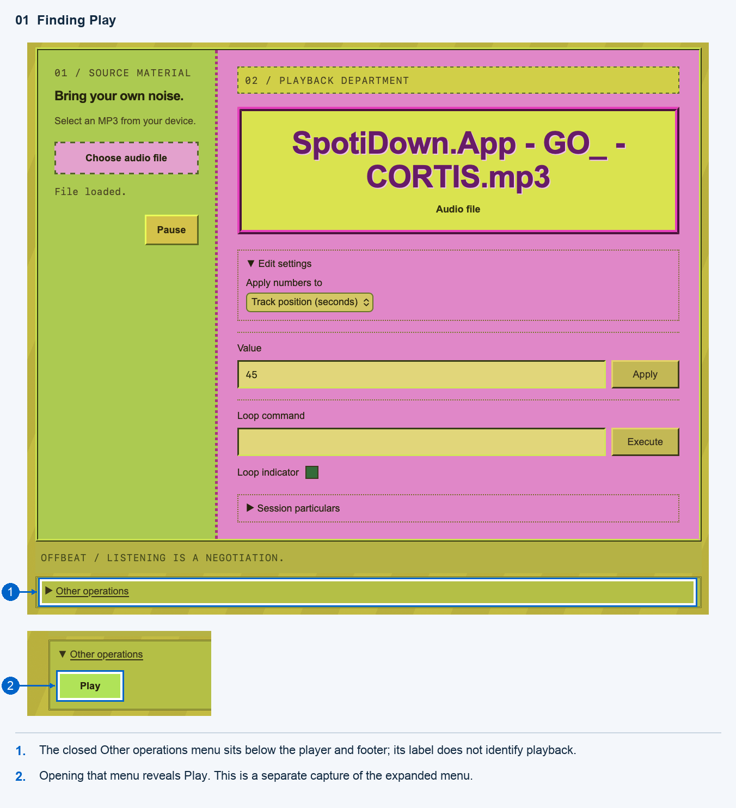

### 2. Caution using interaction modes - Memory
The same Value field changes either volume reduction or track position. Edit settings contains the mode selector; closing it hides the active mode. Neither the field label nor Apply reflects that mode. Entering 70 produces 30% volume in Volume reduction mode but seeks to 70 seconds in Track position mode. The mode persists until changed or a new file is loaded. This creates a specific, recoverable mode error without random behavior.

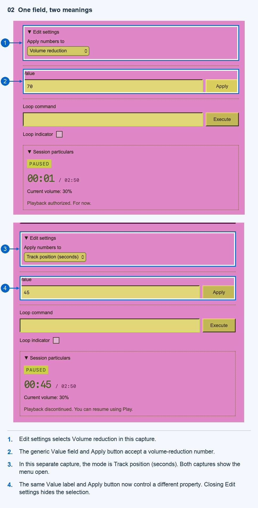

### 3. Don’t make people calculate - Thinking & Problem-Solving
In Volume reduction mode, the required number is 100 minus the desired volume percentage. A user wanting 30% must calculate and enter 70. This arithmetic burden remains even when the mode is known, distinguishing it from the mode-error example.
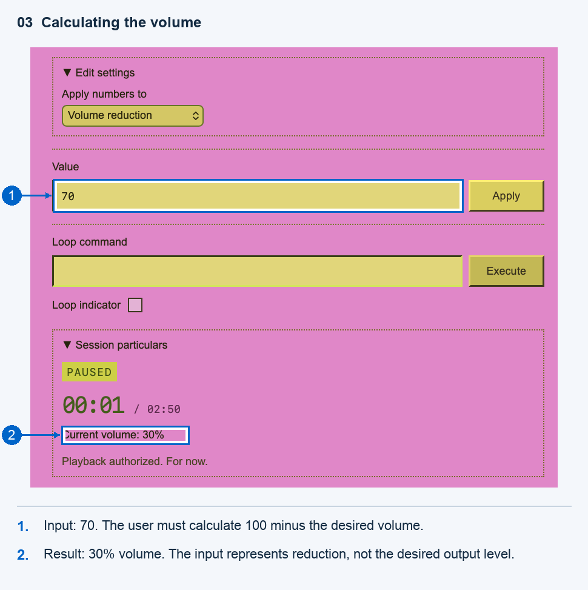

### 4. See and choose is easier than recall and type - Memory
Looping requires the exact lowercase command cycle-track; single-pass disables it. There is no toggle, command suggestion, or dropdown. The reference is in Instructions, which cannot be viewed alongside the controls. Successful commands clear the field. Users must recall and type a command instead of recognizing a visible action.

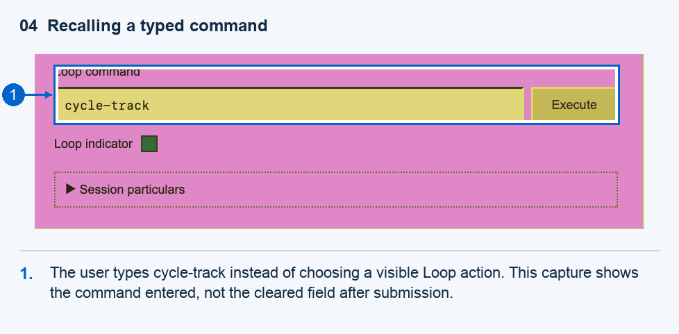

### 5. Make instructions easily accessible during a task - Memory
Instructions replaces the player. The mode rules, volume formula, and position units cannot be consulted while editing. Returning preserves the loaded track and inputs. This creates view-switching and procedural-memory costs; the command example separately addresses recalling action syntax.

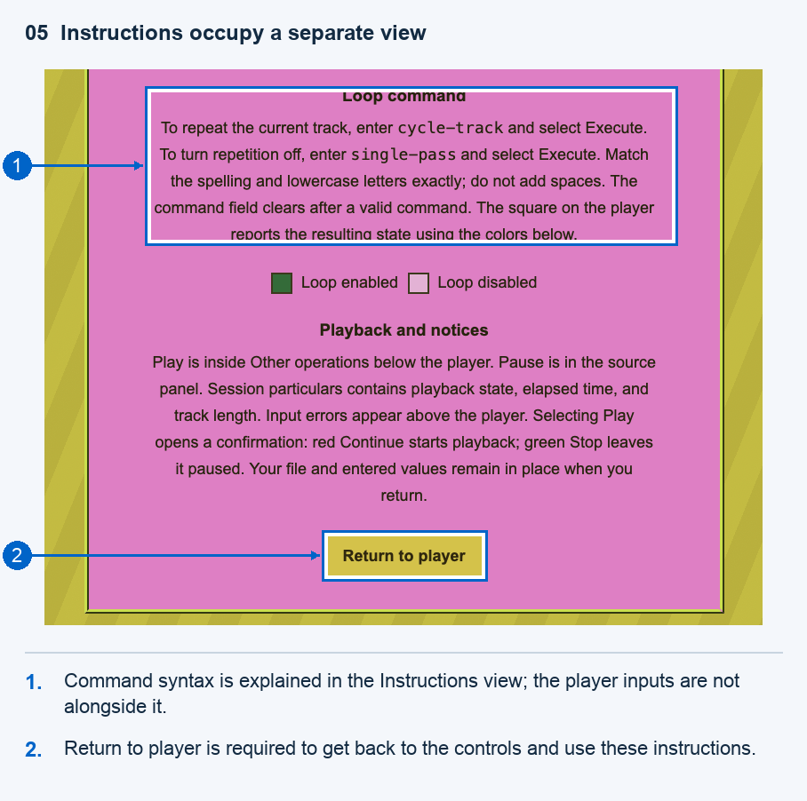

### 6. Put messages where users are looking - Perception
Invalid values and loop commands produce messages below the top header, above the title, rather than beside the submitted field. No automatic scrolling or focus change exposes the notice. Users looking at controls lower on the page must search for the reason an operation failed. Invalid inputs leave the previous state unchanged.

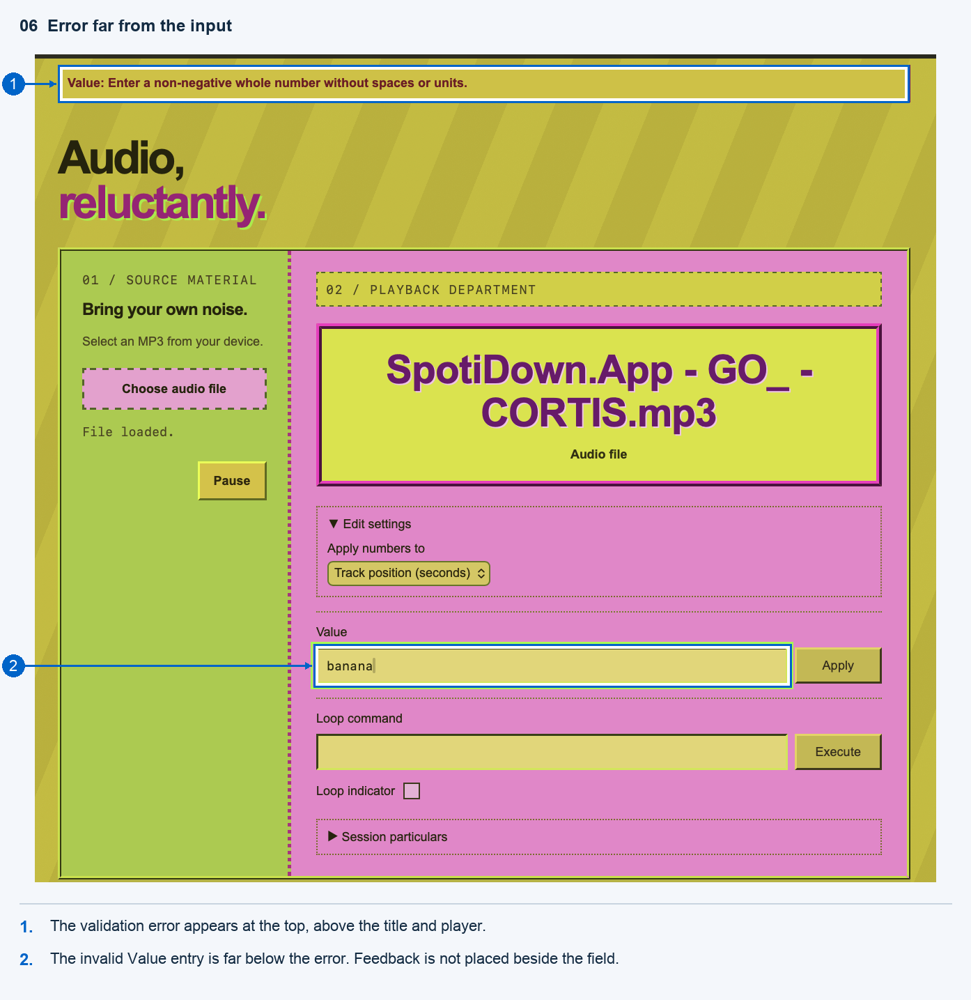

### 7. Use color redundantly with other cues - Perception
The Loop indicator uses only a green square for enabled and a pink square for disabled. It has no on/off text, changing symbol, or state tooltip. The color legend is in Instructions. Users must distinguish and remember the colors; the clashing general palette is not counted separately.

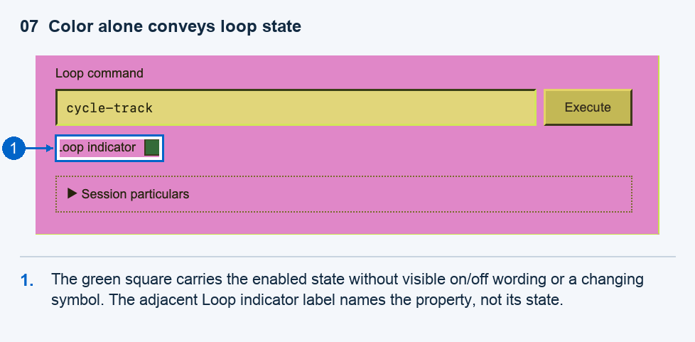

### 8. Avoid centered or right-aligned text - Reading & Language
Instructions centers multiline paragraphs about modes, volume, commands, and playback. Unequal line lengths create different starting points on successive lines, complicating scanning and rereading. This is a reading-layout issue separate from accessing the instructions.

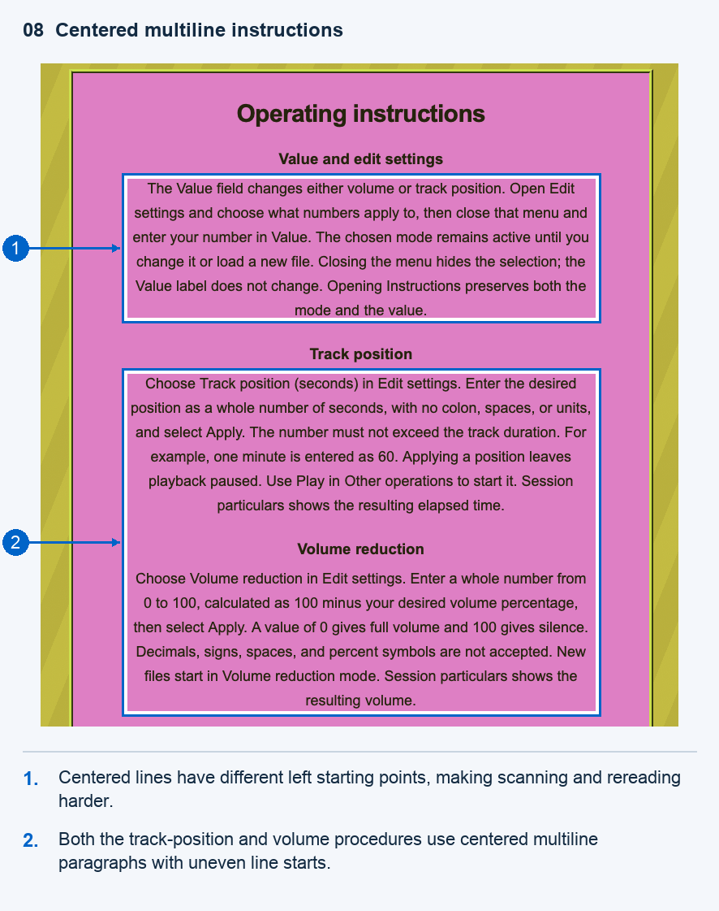

### 9. Prominently indicate system status and progress - Thinking & Problem-Solving
Playing/Paused state, elapsed time, duration, and actual volume are hidden in the closed Session particulars panel. The panel closes on file changes and visits to Instructions. Users must open it to verify state visually. Audio can still reveal that playback is occurring; the violation concerns hidden visual status and progress.

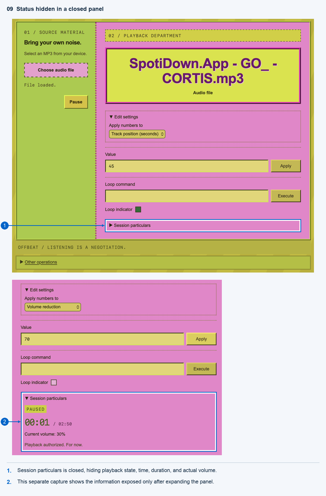

### 10. Create a clear visual hierarchy - Perception
The read-only filename receives oversized purple text, a bright yellow panel, and a thick contrasting border. The task-critical Value and Loop command labels and Apply/Execute buttons are smaller and visually subdued. This reverses task priority: metadata dominates scanning while actionable controls receive less emphasis. It concerns relative visual emphasis, separately from the menu-label problem in example 1.

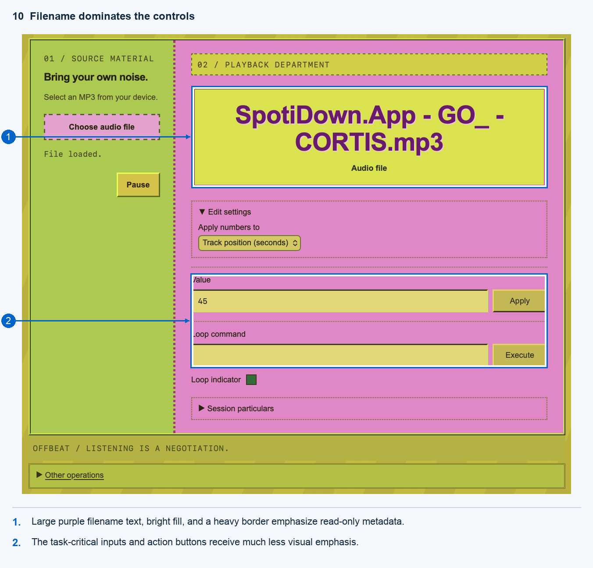

### 11. Breaking familiarity or consistency: counterintuitive use of colors - Attention
Selecting Play in Other operations opens “Start playback?” Red Continue starts audio; green Stop leaves it paused. The labels remain truthful, but the colors conflict with familiar go/stop associations. This is additional lecture-concept coverage, not one of the ten explicit guideline entries. There are no timed interruptions or dismissal delays.

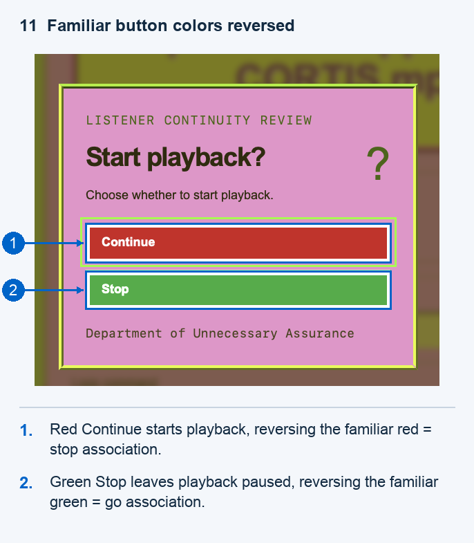

## Completion cheatsheet

1. Select **Choose audio file** and open a local MP3. It must be at least 60 seconds long.
2. Open **Edit settings**, select **Volume reduction**, and close the menu. Enter `70` in **Value**, then select **Apply**. This sets volume to 30%.
3. Enter `cycle-track` in **Loop command** and select **Execute**. The loop indicator becomes green. `single-pass` disables looping.
4. Open **Edit settings**, select **Track position (seconds)**, and close the menu. Enter `45` in **Value** and select **Apply**. This seeks to 00:45; the input uses whole seconds, not MM:SS.
5. Open **Other operations** below the footer and select **Play**. In the confirmation, choose the red **Continue** button. Playback starts from the requested position with volume at 30% and looping on.
6. Open **Session particulars** to verify the playback state, position advancing from 00:45, and 30% volume. The green square confirms looping.

Input errors appear above the title. Instructions explains the modes, formula, commands, and color legend, then Return to player restores the controls. The mode and value survive that navigation. New files reset the mode to Volume reduction and disable looping. Pause is in the source panel. Play is under Other operations below the footer. Green Stop or Escape closes the confirmation with audio paused.

## Sources and implementation notes
The guideline names and topics above refer to the provided course lecture material on usability engineering guidelines. The Apple Music app on macOS is used only for the timing comparison, not as a source of OFFBEAT code.

The implementation was developed with OpenAI Codex assistance. No third-party code snippets, frameworks, external fonts, or music are bundled. Audio is selected locally by the participant and is not uploaded to a server.

## Files

- `index.html`: player, Instructions view, status panel, and confirmation dialog.
- `styles.css`: visual styling and responsive layout.
- `app.js`: local audio loading, controls, validation, and navigation.
